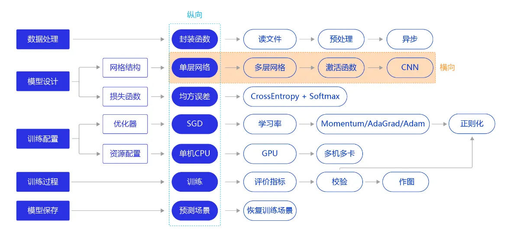

# 西电科创社AI组培养路线

## T1：入门基础

### T1-1 操作基础

[Python飞浆](https://aistudio.baidu.com/course/introduce/1224?directly=1&shared=1)

备注：只学习课节1~4，**掌握python语法基础，常见工具，linux基础，ipynb用法，Git基础**

#### 关于Git基础
Git是项目协作的必备技能，之后会使用Git来提交作业
[Git廖雪峰教程](https://liaoxuefeng.com/books/git/introduction/index.html)

**作业提交说明：**

1. 流程：申请远程仓库协作 -> 创建本地SSH Key并添加到账户 -> 本地创建git分支 -> 提交分支到指定仓库（之后会发仓库链接），如果失败，先pull最新提交
2. 培训：之后如果需要可以统一组织一个作业提交流程展示（线上/线下）
3. 要求：在master分支写明进度情况，在个人分支（以姓名命名）提交作业代码

#### 关于linux基础补充说明

上面的课程中就有linux的部分，关于linux你只需要掌握一下几个问题

- linux是啥
- linux常用命令：复制，粘贴文件，创建删除文件，解压缩包，查看当前路径等操作

推荐linux课程, 直接去B站搜，你只需要搞懂上面的目标就可以了，另外你不需要安装linux系统或者虚拟机(大部分教程最开始都是这些)，你可以直接在ai studio上开终端进行实验，重点掌握上面的常用命令就可以了。

*具体linux常用命令参考：*

[Linux基础知识--阿里云](https://developer.aliyun.com/article/681643#:~:text=Linux%E5%9F%BA%E7%A1%80%E7%9F%A5%E8%AF%86%E2%80%94%E2%80%94Linux%E5%B8%B8%E7%94%A8%E5%91%BD%E4%BB%A4%E5%A4%A7%E5%85%A8%201%20%E4%B8%80%E3%80%81%E6%9F%A5%E7%9C%8B%20ls%202%20%E4%BA%8C%E3%80%81%E5%88%AB%E5%90%8D%20alias%203,rmdir%207%20%E4%B8%83%E3%80%81%E5%88%9B%E5%BB%BA%E6%96%87%E4%BB%B6%20touch%208%20%E5%85%AB%E3%80%81%E5%88%A0%E9%99%A4%E6%96%87%E4%BB%B6%E6%88%96%E7%9B%AE%E5%BD%95%20rm%20%E6%9B%B4%E5%A4%9A%E9%A0%85%E7%9B%AE)

#### 关于Python基础补充

[Python语言程序设计-北京理工大学](https://www.icourse163.org/course/BIT-268001?from=searchPage&outVendor=zw_mooc_pcssjg_)

学习范围为：**学到第8周（前面的内容较多建议都在Aistudio完成实际操作）**

### T1-2 理论基础与代码实践



[飞浆PaddlePaddle-源于产业实践的开源深度学习平台](https://www.paddlepaddle.org.cn/tutorials/projectdetail/3713999)

[飞浆学习赛：猫的十二分类体验赛-飞浆AI Studio](https://aistudio.baidu.com/aistudio/competition/detail/136/0/introduction)

**任务点规划：**

1.学习深度学习基础，可以参考上面链接的教程，作为指引，查找相关补充资料

2.在AI Studio在线完成猫猫十二分类的代码编写与运行，理解baseline代码


### T1-3 实验管理与参数搜索（建议使用云服务器+pycharm/termius开发）

假设我们已经实现了训练模型的脚本train.py,并且可以在命令行直接指定对应训练超参数，例如：指定了epoch,lr,batchsize三个超参数(不会写？参考https://zhuanlan.zhihu.com/p/56922793)

```powershell
python train.py --epoch 12 --lr 0.01 --bs 64
```

这样的好处就是，每次实验都可以指定不同的超参数进行训练，因此下一步就是如何**确定最优的参数组合**，以及**可视化**管理好这些实验


#### 注册wandb/Swanlab账号并学习线上管理项目

[wandb document](https://docs.wandb.ai/guides)
[Swanlab](https://swanlab.cn)

#### 学习wandb/Swanlab实现超参数搜索

[wandb超参数搜索](https://github.com/lyhue1991/eat_pytorch_in_20_days/blob/master/A-7%2C30%E5%88%86%E9%92%9F%E5%90%83%E6%8E%89wandb%E5%8F%AF%E8%A7%86%E5%8C%96%E8%87%AA%E5%8A%A8%E8%B0%83%E5%8F%82.ipynb)

#### 实验可复现性测试

*你需要保证，你的这组参数设置，每次这样设置训练出来的结果都是一样的（可复现）*

[为什么设定随机种子仍无法复现相同结果](https://github.com/PaddlePaddle/Paddle/issues/46012)

### T1-4 可视化部署

参考使用gradio完成在线部署

[Gradio:轻松实现AI算法可视化部署](https://zhuanlan.zhihu.com/p/374238080
)


**任务点安排：**

- 使用wandb实现训练过程中ACC和loss的可视化
- 解决实验可复现问题
- 使用wandb/Swanlab实现随机参数搜索，确定最优参数
- 可视化


## 重要！T1时间DDL

大一同学：12月7日

大二同学：11月20日


## AI基础补充

完成李沐或吴恩达老师的线上课程，并手动完成课上的作业


# T2 Find Your Mentor
