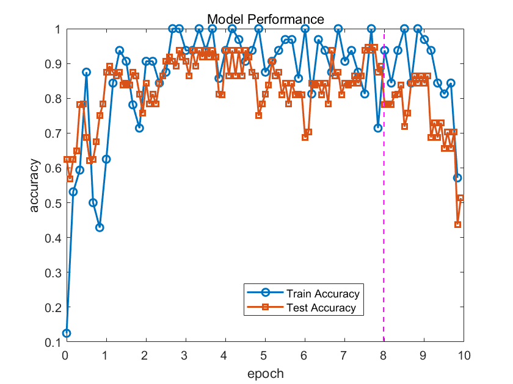

**这里是作业提交的示例分支**

## 龚和东AI学习过程记录

### 2024.9.1
使用多层感知机训练高钾/铅钡玻璃二分类模型。由于数据集较小，训练过程使用交叉验证：

由于交叉验证的特性，训练前期模型精度起伏大，后期趋于稳定。

### 2024.9.10
使用自采集数据集，在经典LeNet卷积网络下训练图片分类模型，实现对NTU十大著名景点的分类，训练曲线如下：

### 2024.9.20
使用亚马逊和大西洋海岸植被遥感数据集，在U-Net网络下训练植被语义分割模型。
困难：
    1. 模型难收敛
        2. 网络参数复杂，难以调整
        3. 精度计算函数无统一标准

### 2024.10.1
使用自拟的中文语料在经典RNN循环神经网络下训练语句扩写模型，并使用SwanLab管理训练参数。训练过程如下：

